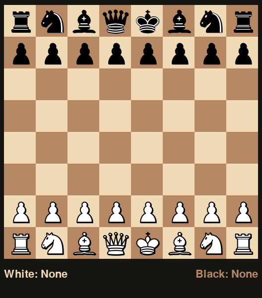

## 1. The project

The following is the final submission for the course Computer Science (Algorithms) - 20602 with professors C.Feinauer and A.Celli at Università Bocconi.

The goal of this project is to implement a Chess Engine using the MiniMax Algorithm with Alpha-Beta pruning. 


## 2. Requirements

In order to run this program, the [Python Chess](https://python-chess.readthedocs.io/en/latest/) and
[Pygame](https://www.pygame.org/docs/) libraries must be installed. To do so, run the following command:


 ```bash
 pip install -r requirements.txt
 ````


## 2. The Chess AI    


The methods which make up this Chess AI are located in the `/core/`  directory.  


### 2.1 Move Generation & Heuristics    


The file `chess_engine.py` contains the different "move generator" functions, namely functions that accept a `chess.Board` and return an optimal `chess.Move`. 


A static evaluation of a chess board is a function that returns a single number summarizing the value of the board. In this implementation the 
static evaluation rely con chess heuristics.

The heuristics used, which can be found in the file `chess_heuristics.py`, are the following:

1) Piece Value

2) Diagonal Control by Queen & Bishop pieces

3) Control of center squares and number of pieces in “controlling positions”


### 2.2 The MinMax Algorithm    


The MiniMax algorithm is based on the principle that a maximizing player looks for a move that leads to a large positive number while assuming that the other player, the minimizer, is trying to force the play towards a negative value.

In practice, the MiniMax Algorithm relies on the following assumptions: 

- The algorithm performs a depth first search

- The terminal nodes’ score is equal to their static value

- At each new node the score is either the minimum or the maximum of the children’s score, depending on which player’s turn it is 


### 2.2  Alpha-Beta Pruning   


Alpha-Beta Pruning aims to optimize the MimiMax Algorithm by avoiding the evaluation of all branches. 

The MiniMax algorithm with Alpha-Beta pruning can be found in `chess_engine.py` and relies on the following assumptions:

- ⍺, for the maximizer, and  ꞵ ,  for the minimizer, represent a lower and upper bound of each player’s score

- ⍺ is initialized at - ∞ and ꞵ at + ∞

- Whenever a new node with a better score is discovered, the values of ⍺ and ꞵ get updated

The above is performed as long as all children are evaluated or ⍺ < ꞵ, since it means that there is an interval in which each player can hope to improve its own score.


## 3. Graphical User Interface and Game Initialization  


By running the `chess_ai.py` file it is possible to activate the graphical interface and play against minimax algorithm.  


  


### Other Use cases:  


the `play_chess()` function accepts a chess board and
two optional arguments, `white` and `black` , which can be any move generator function.

```python
board = chess.Board()

# No additional arguments, the user will play both sides of the board  

play_chess(board)

# The computer will play both sides using the selected move-generator function  

play_chess(board, white = move_generation_function_a, 
black = move_generation_function_b)
```


## 3.3 Performance Evaluation   


The file `performance_eval.py` allows the Chess AI to play against itself many times in rapid succession. 

By running it with the current setup, it can be used to assess the increase in running time given different depth-value options.


